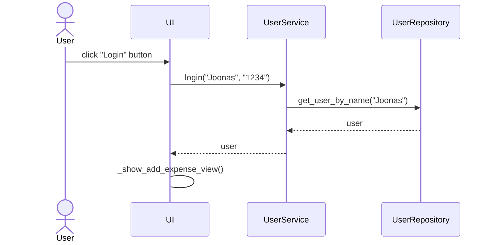

# Arkkitehtuurikuvaus

## Ohjelman Rakenne

Ohjelman rakenne muodostuu kerrosarkkitehtuurista, jota kuvaa seuraava pakkauskaavio:

_UI_ pakkaus huolehtii käyttöliittymään liittyvästä koodista, _services_ sovelluslogiikasta, _repositories_ käyttäjien ja kulujen tietojen tallennuksesta sekä _entities_ esittää ohjelmassa yksittäistä käyttäjää ja kulua.

## Sovelluksen päätoiminnallisuudet

Sekvenssikaavioita ohjelman oleellisista päätoiminnallisuuksista

### Käyttäjän kirjautuminen

Käyttäjän täytettyä käyttäjätunnuksen ja salasanansa, niin painamalla Login nappia, ohjelman suoritus etenee sekvenssikaavion mukaisesti näin:

