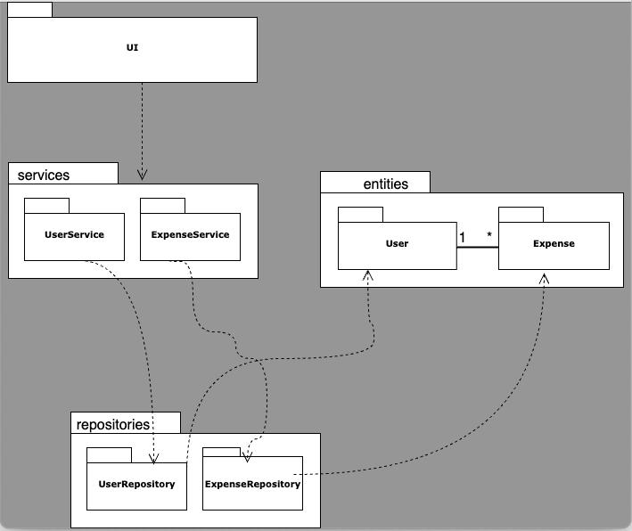

# Arkkitehtuurikuvaus

## Ohjelman Rakenne

Ohjelman rakenne muodostuu kerrosarkkitehtuurista, jota kuvaa seuraava pakkauskaavio:

_UI_ pakkaus huolehtii käyttöliittymään liittyvästä koodista, _services_ sovelluslogiikasta, _repositories_ käyttäjien ja kulujen tietojen tallennuksesta sekä _entities_ esittää ohjelmassa yksittäistä käyttäjää ja kulua.

## Käyttöliittymä

Käyttöliittymä sisältää viisi erilaista näkymää:

- Kirjautuminen sovellukseen
- Uuden käyttäjän luominen
- Budjetin asettaminen sekä uuden kulun luominen (yhteinen näkymä)
- Kulujen näyttämisnäkymä
- Kulun muokkausnäkymä

Nämä on toteutettu erillisinä luokkina. Näkymien näyttäminen annetaan UI-luokan vastuuksi, jossa nämä importataan.

## Sovelluslogiikka

Sovelluksen loogisen tietomallin muodostavat luokat User ja Expense, jotka kuvaavat käyttäjiä ja heidän kulujaan:

Toiminnallisista kokonaisuuksista vastaa luokan UserService ja ExpenseService oliot. Nämä luokat tarjoavat UI:n toiminnallisuuksia, kuten kirjautumisen, kulujen lisäämisen, poistamisen sekä muokkaamisen. Metodeja ovat esim:

- `login(username, password)`
- `add_expense(description, amount, date, username)`
- `update_expense(expense_id, description, amount, date)`
- `delete_expense(expense_id)`

Sovelluslogiikka käyttää repositories-pakkausta tietojen tallennukseen ja hakemiseen. Käyttäjien tiedoista vastaa UserRepository ja kulujen tiedoista vastaa ExpenseRepository. Näiden avulla Sovelluslogiikka kommunikoi tietokannan kanssa.

## Sovelluksen päätoiminnallisuudet

Sekvenssikaavioita ohjelman oleellisista päätoiminnallisuuksista

### Käyttäjän kirjautuminen

Käyttäjän täytettyä käyttäjätunnuksen ja salasanansa, niin painamalla Login nappia, ohjelman suoritus etenee sekvenssikaavion mukaisesti näin:

### Uuden käyttäjän luominen

Uuden käyttäjäluomis näkymässä, kun käyttäjä täyttää käyttäjätunnuksen ja salasanan tiedot, painamalla "Create User" nappia uuden käyttäjän luominen etenee sekvenssikaavion mukaisesti näin:

