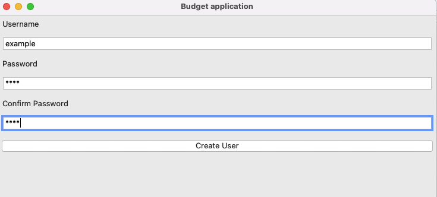

# Käyttöohje

Lataa projektin viimeisimmän [releasen](https://github.com/BorisBanchev/ot-harjoitustyo/releases) lähdekoodi Assets-kohdasta Source code.

## Konfigurointi

Luo .env-tiedosto seuraavalla sisällöllä ennen riippuvuuksien asennusta:

```bash
DATABASE_FILENAME=<tietokanta-tiedoston-nimi> # esim. database.sqlite
```

## Ohjelman käynnistys

Ennen käynnistämistä, asenna riippuvuudet projektiin:

```bash
poetry install
```

Suorita tietokannan alustus:

```bash
poetry run invoke build
```

Käynnistä sovellus:

```bash
poetry run invoke start
```

## Kirjautuminen

Sovellukseen kirjaudutaan täyttämällä voimassa oleva käyttäjätunnus ja salasana ja painamalla **"Login"**


## Uuden käyttäjän luominen

Sovellukseen luodaan uusi käyttäjä täyttämällä **vähintään 4 merkkiä** pitkän käyttäjätunnuksen ja salasanan sekä tämän vahvistus



## Uuden budjetin ja kulun lisääminen

Kirjautumisen jälkeen voidaan asettaa budjetti ja luoda uusi kulu täyttämällä seuraavat kentät kulun lisäys näkymässä


## Kulujen poistaminen ja selaaminen

Menemällä kulujen näkymään painamalla **"Show Expenses"**, nähdään omat kulut ja niitä voidaan poistaa klikkaamalla kulua ja painamalla nappia **"Delete Expense"**


## Kulun muokkaaminen

Valitsemalla kulun ja klikkaamalla **"Update Expense"** nappia voidaan muokkausnäkymästä muokata kulua täyttämällä seuraavat kentät


