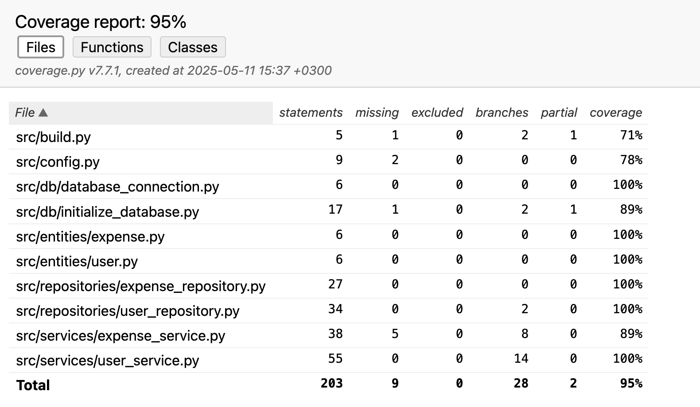

# Testausdokumentti

Ohjelmaa on testattu sekä automatisoiduin yksikkö- ja integraatiotestein unittestilla sekä manuaalisesti tapahtunein järjestelmätason testein.

## Yksikkö- ja integraatiotestaus

Ohjelman kaikkia toiminnallisuuksia on testattu UnitTest-yksikkötesteillä, ja testit, jotka testaavat mm. sovelluslogiikka-luokkia UserService ja ExpenseService on toteutettu, niin että ne testaavat myös alempia kerroksia ohjelmasta.

### Sovelluslogiikka

Sovelluslogiikasta vastaavia luokkia UserService ja ExpenseService on testattu luokilla [TestUserService](https://github.com/BorisBanchev/ot-harjoitustyo/blob/main/budget-management-app/src/tests/services/user_service_test.py)- ja [TestExpenseService](https://github.com/BorisBanchev/ot-harjoitustyo/blob/main/budget-management-app/src/tests/services/expense_service_test.py)-testiluokilla.

### Repositorio-luokat

Repositorio-luokkia UserRepository ja ExpenseRepository testataan testiluokilla [TestUserRepository](https://github.com/BorisBanchev/ot-harjoitustyo/blob/main/budget-management-app/src/tests/repositories/user_repository_test.py) ja [TestExpenseRepository](https://github.com/BorisBanchev/ot-harjoitustyo/blob/main/budget-management-app/src/tests/repositories/expense_repository_test.py).

### Testauskattavuus

Sovelluksen testauskattavuus kattaa ohjelman kaikki koodin lukuunottamatta käyttöliittymää UI:luokka.
Sovelluksen testien haarautumakattavuus on 95%:


### Järjestelmätestaus

Sovelluksen järjestelmätestaus on suoritettu manuaalisesti.

### Asennus ja konfigurointi

Sovellus on testattu käyttöohjeen kuvaamalla tavalla macOs- ja Linux ympäristöön. Testeissä käytetään myös .env.test kautta omaa testitietokantaa tietojen tallentamiseen.

### Toiminnallisuudet

Toiminnallisuuksista kaikkia on testattu yksikkötesteillä sekä oikeilla että virheellisillä syötteillä.

## Sovellukseen jääneet laatuongelmat

Sovellus ei anna oikeanlaista virheviestiä seuraavissa tilainteissa:

- Jos käyttäjä ohittaa README.md:n asennusohjeista tietokantaalustuksen eli komennon:
  ```bash
    poetry run invoke build
  ```
